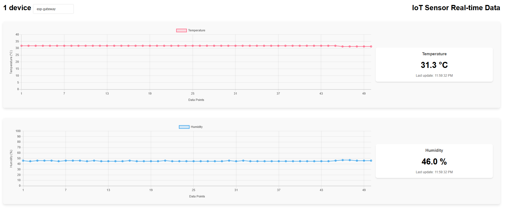

# skyward-flora

Prototype for a solution to read and transfer data between plant sensors and the cloud.

---

## Description

### Embedded firmware

The `sensor-iiot` directory is a PlatformIO project, containing the Arduino-based firmware to read from two sensors. These data can then be transferred to a Microsoft Azure IoT Hub.

The project was tested on a system with the following components:

- NodeMCU-32S ESP32 WiFi+Bluetooth Development Board
- DHT11 sensor
- Sen0193 capacitive soil moisture sensor

### Web application

The `web-app` directory is a FastAPI application that reads messages sent to the IoT Hub and displays them onto a webpage.

## Credits

- [azure-sdk-C-arduino](https://github.com/Azure/azure-sdk-for-c-arduino)
- [azure-sdk-for-python](https://github.com/Azure/azure-sdk-for-python/blob/azure-eventhub_5.14.0/sdk/eventhub/azure-eventhub/samples/async_samples/iot_hub_connection_string_receive_async.py)
- [web-apps-node-iot-hub-data-visualization](https://github.com/Azure-Samples/web-apps-node-iot-hub-data-visualization)
